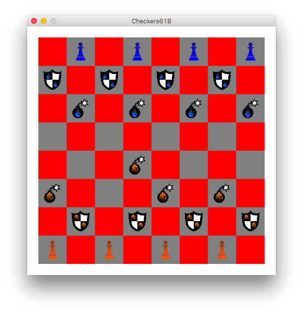

# Checkers Reloaded

We all love the classic game of Checkers. In this project, we add a twist by introducing two new pieces: Bomb Pieces and Shield Pieces. For details on how these pieces differ, see the rules down below. 

## Screenshots

## Implementation

Andre Askarinam ([andreaskari@berkeley.edu](mailto:andreaskari@berkeley.edu))

## Rules

See rules [here](http://cs61b.ug/sp15/materials/proj/proj0/proj0.html)

## Acknowledgments

* This is an implementation of the Checkers project for the Data Structures course of UC Berkeley.